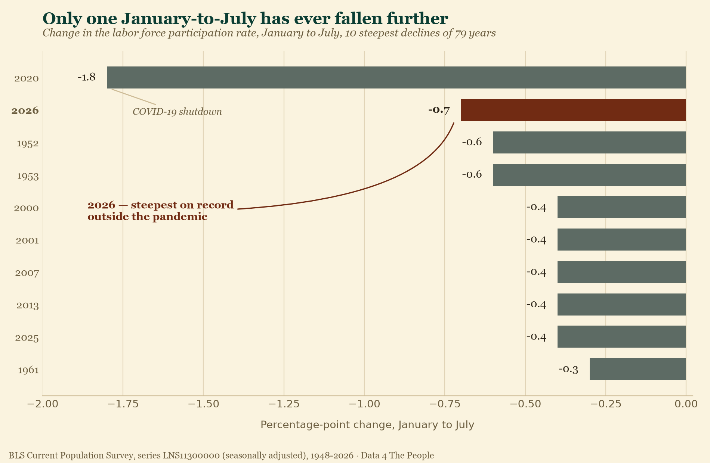
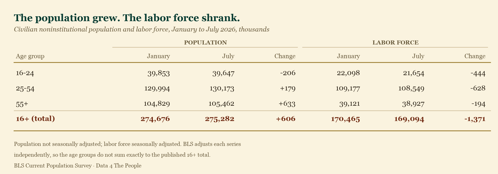
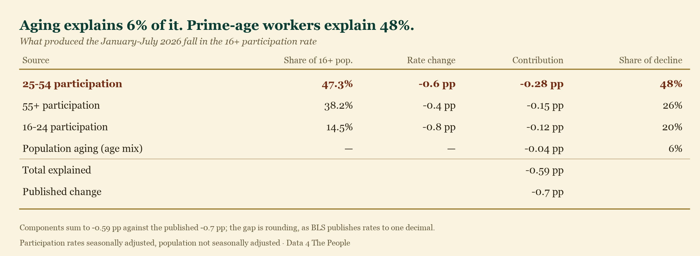
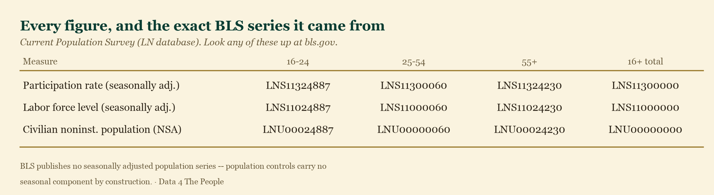

# The line the BLS buried

Happy Friday.

We're still on our planned writing hiatus while we work diligently on preparing for our 501(c)(3) filing, but we just couldn't stay silent about today's labor data release. The BLS simply isn't giving the public the context needed to understand how striking this data really is.

If you read through the BLS press release, you have to get six paragraphs in before you reach this line:

> "Since January, the labor force participation rate declined by 0.7 percentage point."

For anyone who has spent time with our **Beyond the Unemployment Rate** visualization, that sentence may have struck fear into your heart, as it did ours. But no context was provided. Nothing. Just this seemingly innocuous statement.

Well, here is the context — freely available to all, using our recently published visualization, which has been updated with July's data.

<!-- CHART 1: pull from the live tool -->
<!-- https://data4thepeople.github.io/CPS_monthly_explorer/v2/output/ln_explorer.html -->

---

## We went back 79 years

We looked at every January-to-July period in the entire history of the data — 79 of them, going back to 1948 — to see whether participation has ever fallen this steeply.

It has, once. In 2020.

Remember 2020: the year we **paid people not to participate in the labor force**, to slow the unchecked spread of COVID in the days before a vaccine existed.

Take the pandemic out and 2026 stands alone. This is the steepest January-to-July decline in labor force participation in the recorded history of the series, outside of a deliberate national shutdown.

Note what else is on that list: **2025**. This is not a one-month blip or a single bad print. Participation has been eroding for eighteen months. From January 2025 to July 2026, the rate has fallen a full **1.2 percentage points**.

At 61.4%, July 2026 is the lowest July participation rate since **1975**.

---

## We expected aging. We were wrong.

We went deeper to deconstruct this decline. Our expectation, like most people's, was that the aging of the U.S. population would be the driver. The boomers are retiring; a bigger share of the population is over 55; people over 55 participate at much lower rates. Case closed.

That is not what the data says.

To see it properly you have to look at absolute numbers, not just rates.

Read that bottom row twice. **The population grew by 606,000 while the labor force shrank by 1,371,000.** In six months.

And look at the 25-54 row. The prime-age population *grew* by 179,000 — and its labor force still fell by 628,000. That decline cannot be explained by demographics. Those are working-age people, in the prime of their careers, leaving the labor force.

So we decomposed the headline number: how much of the 0.7-point fall came from people's behavior inside each age group, and how much came from the age mix of the population shifting?

**Population aging accounts for 6% of the decline. Six percent.**

The 55+ share of the population did rise, and that group does participate at a much lower rate. But over six months that shift is far too small to matter. Roughly **94% of the decline is people inside every age group leaving the labor force** — not the country getting older.

And the single largest piece of it is prime-age workers, at **48%** — more than the 55+ and youth contributions combined.

The prime-age rate itself fell from **84.0% in January to 83.4% in July**. That 0.6-point drop is the **third largest** in the 79-year history of the data.

---

## Go look for yourself

We could go far deeper here. You can break this down by race, ethnicity, education, nativity, sex, and more — and the story gets more interesting, not less, when you do.

But the best way to learn is to experience it. So go use our updated data visualization and start exploring.

**[Beyond the Unemployment Rate →](https://data4thepeople.github.io/CPS_monthly_explorer/v2/output/ln_explorer.html)**

The data is sending a clear signal that we are living through a historic moment in our labor market. People will argue about the cause — immigration policy, AI, something else. But while we are entertained by petty arguments on social media, the data is screaming.

Ditch the online drama and study the data. We need to establish a shared truth about what is really happening in our labor force — still the engine of our real economy, and the key variable driving income taxes, property taxes, Social Security, and Medicare — before it is too late.

---

## Methodology

Every figure above comes from one published BLS Current Population Survey series. Nothing is modeled or estimated.

### How we separated aging from behavior

The overall participation rate is not an independent number. It is a weighted average of each age group's participation rate, weighted by that group's share of the population:

> **overall rate = (16-24 share × 16-24 rate) + (25-54 share × 25-54 rate) + (55+ share × 55+ rate)**

That means the overall rate can fall for two entirely different reasons:

1. **Behavior.** People inside an age group stop participating — the group's *rate* falls.
2. **Aging.** The population shifts toward groups that participate less — the group *shares* change, even if nobody's behavior changes at all.

To tell them apart, we changed one thing at a time.

**For the aging effect,** we froze every age group's participation rate at its January value and let only the population shares move to their July values. Nobody's behavior changes in this scenario; only the age mix does. Between January and July the 55+ share of the population rose from 38.16% to 38.31%, and that group participates at just 37.3% — so mechanically the overall rate is dragged down. The result: **−0.04 percentage points.**

**For the behavior effect,** we did the reverse: froze the population shares at their January values and let only the group rates move. The result: **−0.55 percentage points.**

Together those explain −0.59 of the published −0.7. Aging's share is −0.04 ÷ −0.59 = **6%**.

The remaining gap to −0.7 is rounding, not a missing factor. BLS publishes participation rates to one decimal place, so a decomposition carried to two decimals cannot close exactly against a one-decimal headline.

We ran this two ways — weighting by January shares, and by the average of January and July shares (which removes the interaction term entirely). Aging came out at 6.4% and 6.3%. The finding does not depend on the choice.

As a further check, multiplying each group's population share by its participation rate reproduces the published 16+ rate to within 0.07 points in January and 0.04 in July. If our weights were wrong, that identity would not hold.

### Why January to July

BLS applies new population controls each January, so levels on either side of that seam sit on different population bases and are not directly comparable. A January-to-July window sits entirely on one basis. That is what makes all 79 years comparable to each other without any adjustment — and it is why we used the same window BLS used in its own press release.

Reproduce any of it yourself: [github.com/Data4ThePeople/CPS_monthly_explorer](https://github.com/Data4ThePeople/CPS_monthly_explorer) — `analysis/make_charts.py` regenerates the chart and both tables from the source data.
