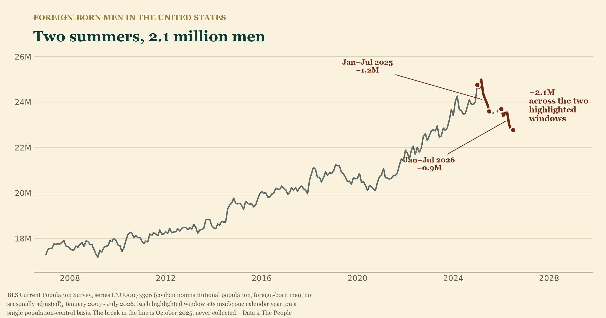
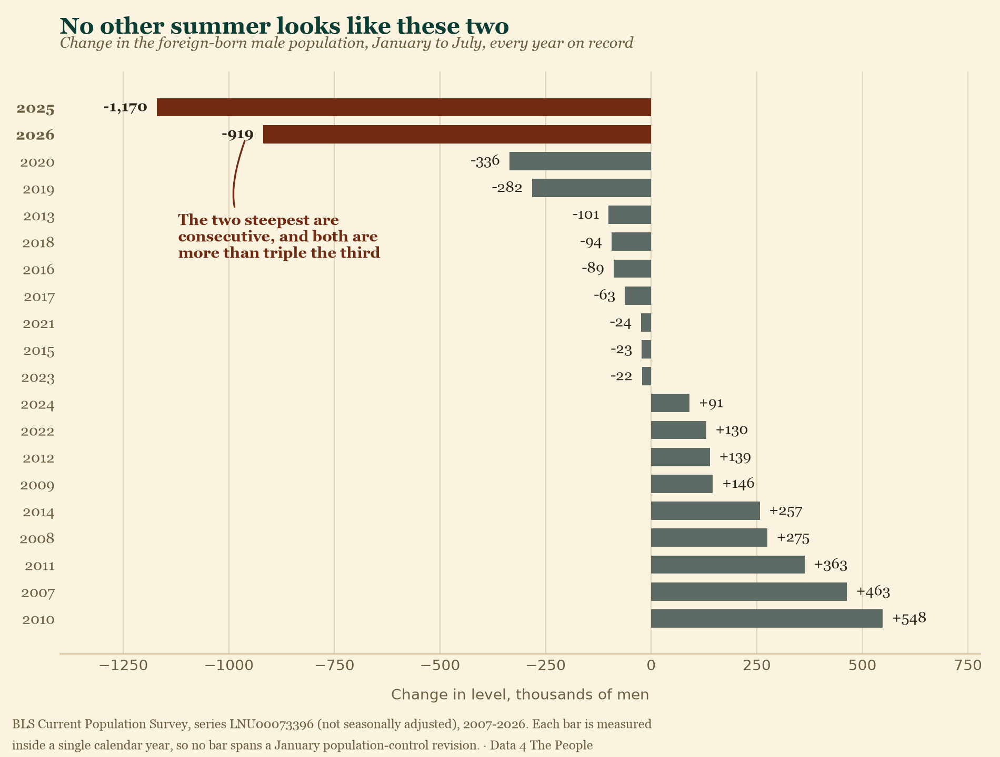
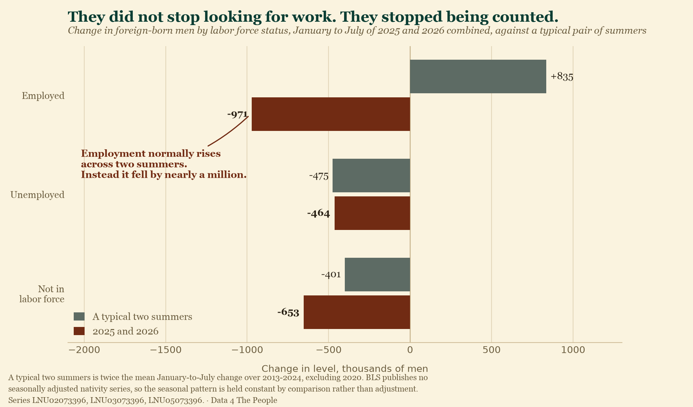
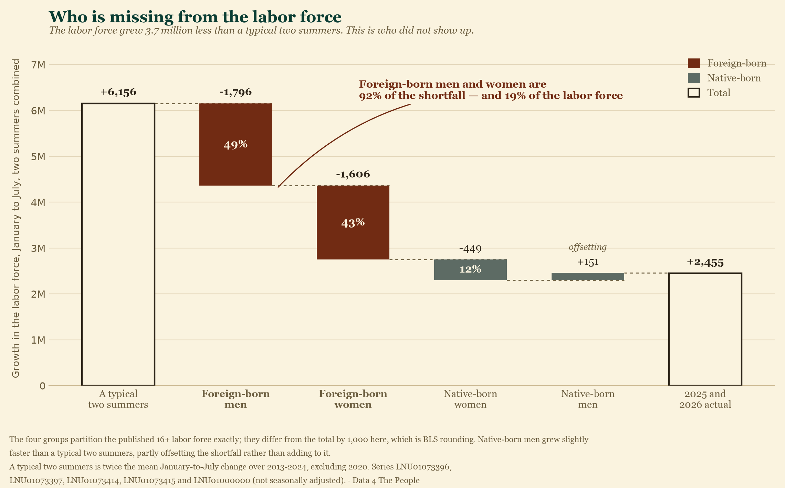
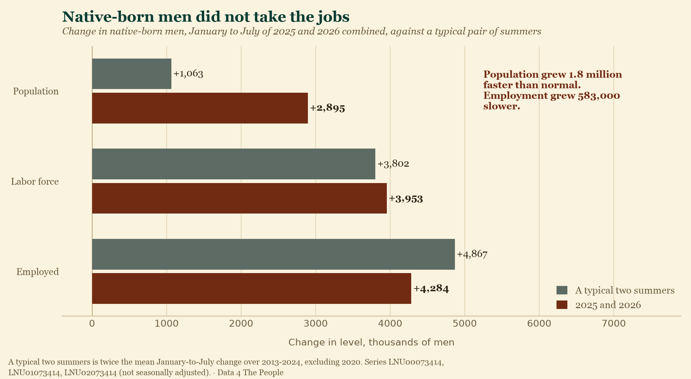
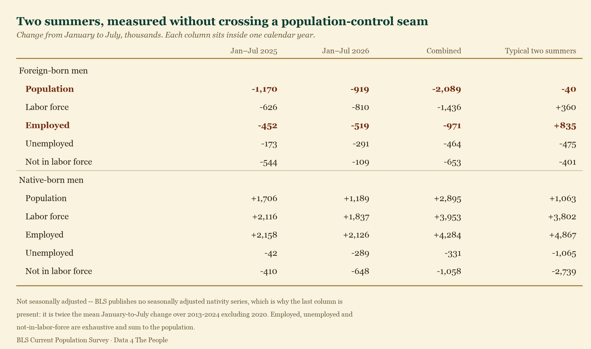
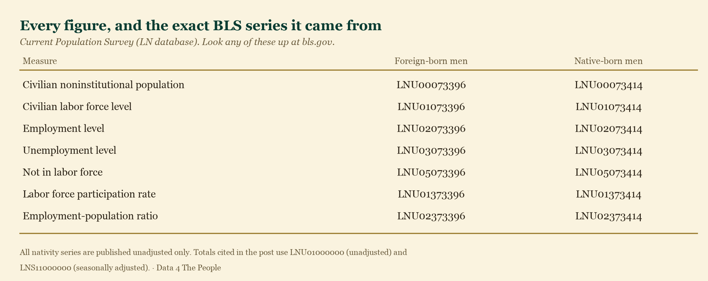

# The men who vanished

There is a number in the labor data that nobody put in a press release.

Across the last two summers, the foreign-born male population of the United
States has fallen by **2.1 million people**.

Not 2.1 million fewer working. Not 2.1 million discouraged. Two point one
million fewer *counted at all* — gone from the population the Bureau of Labor
Statistics measures every month.

We measure it in two pieces, January to July of 2025 and January to July of
2026, because that is the only honest way to measure it. BLS installs new
population estimates every January and does not revise the months before them,
so a level in December and a level the following January are not the same ruler.
Each window above sits entirely inside one calendar year, on one ruler. The
January 2026 revision alone moved the published native-born male population by
1.45 million in a single month — which is exactly why we refuse to measure
across it.

---

## No other summer looks like these two

January to July is a seasonal stretch: employment climbs into the summer, and
people move off the sidelines and into work. So a January-to-July change means
nothing on its own. It means something when you line it up against the same
stretch in every other year.

2025 and 2026 are the two steepest January-to-July declines in the history of
the series. The third steepest is 2020 — the COVID shutdown — at 336,000. Both
of ours are more than triple it. In a normal year this number barely moves; the
typical summer change is about 20,000.

Foreign-born men's **labor force** tells the same story. The January-to-July
2026 decline of 810,000 is the steepest on record, worse than the COVID summer.
2025 is third.

---

## They did not stop looking for work

Here is the part that should stop you.

When people leave the labor force in an ordinary downturn, we can watch them go.
They move from employed, to unemployed, to *not in the labor force* — the
category that holds retirees, students, caregivers, and people who have given up
looking. The population stays the same. The buckets shift.

That is not what happened here.

Foreign-born male employment normally **rises** across two summers — by about
835,000. Instead it fell by 971,000. That is a swing of roughly 1.8 million
against what a normal pair of summers delivers.

Against the same benchmark, the other two categories are unremarkable.
Unemployment fell by 464,000, which is what it normally does — the typical
figure is 475,000. The not-in-labor-force count fell by 653,000 against a
typical 401,000.

Line those up and the arithmetic is stark. Of the 2.05 million-person gap
between these two summers and a typical two summers:

| | Gap vs. a typical two summers | Share |
|---|---:|---:|
| **Employed** | **−1,806,000** | **88%** |
| Not in labor force | −252,000 | 12% |
| Unemployed | +11,000 | 0% |

**Eighty-eight percent of the missing men came out of employment.** Unemployment
contributed nothing at all. These men did not lose jobs and start looking. They
did not give up and move to the sidelines. They were working, and then they were
not counted.

---

## This is the labor force story

For eighteen months the commentary has been about a shrinking labor force. Here
is how much of it is this one group.

Across these two summers the entire U.S. labor force grew 2.5 million, against a
typical 6.2 million — a shortfall of **3.7 million**.

The four nativity-and-sex groups add up to the published total exactly, so we
can put the whole shortfall on one chart and see who is missing from it.

Foreign-born men are **1.8 million of the shortfall — 49% of it**, while being
10.2% of the labor force. That alone is a rate of contribution roughly five
times their size.

But look at the second bar. Foreign-born **women** are another 1.6 million, or
43%. Together, foreign-born workers account for **92% of the entire shortfall**
while making up 19% of the labor force.

And look at the fourth bar. Native-born men did not merely fail to fill the gap
— they came in 151,000 *above* a typical two summers, slightly offsetting it.
Native-born women came in 449,000 below.

So the honest headline is broader than the one we started with. This is not only
a story about foreign-born men. It is a story about foreign-born workers, and
men are a little over half of it.

## Native-born men did not fill the gap

The obvious next question: if roughly a million jobs were vacated, did
native-born men take them?

This is where the comparison does double duty. Native-born men live through the
same summers, the same seasons, the same economy. If the seasonal pattern or the
business cycle were driving the foreign-born numbers, it would show up in the
native-born numbers too.

It does not.

Native-born men's population grew by 2,895,000 across these two summers, against
a typical 1,063,000 — **1.8 million faster than normal.** Their labor force grew
3,953,000 against a typical 3,802,000, essentially dead on.

And their employment grew 4,284,000 against a typical 4,867,000 — **583,000
slower than normal.**

Read those together. Native-born men arrived in the working-age population far
faster than usual, and got jobs *more slowly* than usual. Their participation
rate rose 0.9 points from January to July 2026 against a typical 1.5 — the
smallest January-to-July rise on record except 2020.

Whatever absorbed those vacated jobs, it was not native-born men entering work
at a higher rate. There is no sign of them stepping in at all.

---

## What this does not tell you

We are going to be more careful here than the discourse will be.

**The CPS does not measure emigration, and it does not ask about legal status.**
It is a household survey. It counts people who live at a sampled address and
answer the door. When someone stops being counted, the survey cannot tell you
whether they left the country, moved somewhere the sample did not reach, or
stopped opening the door to a federal interviewer. All three produce the same
missing row.

That distinction matters enormously for policy and we cannot settle it with this
data. What we *can* say is narrower and still striking: 2.1 million foreign-born
men who were counted are not counted now, and they were overwhelmingly employed
when they were.

**Nativity is a survey answer, not a population control.** BLS controls the CPS
to independent population estimates by age, sex, race and ethnicity — but not by
nativity. The foreign-born and native-born series are shares of a controlled
total, which means they move against each other by construction. A change in who
answers, or how they answer, moves both. That is one more reason the native-born
population growing 1.8 million faster than normal is not, on its own, evidence
of anything: it is partly the mirror image of the foreign-born decline.

The employment finding does not have that problem. Nothing about a controlled
total forces native-born male *employment* to come in 583,000 below its own
seasonal norm.

---

## Go look for yourself

Every series in this post is public, free, and updated monthly. None of it is
modeled, smoothed, or estimated by us.

**[Beyond the Unemployment Rate →](https://data4thepeople.github.io/CPS_monthly_explorer/v2/output/ln_explorer.html)**

We said last month that the data was screaming and that people would argue about
the cause. This is the loudest part of it. Two million men, mostly working, are
no longer in the count — and the labor force that everyone is worried about is
short by roughly the same amount.

You can decide what you think should be done about that. But the argument has to
start from the number.

---

## Methodology

Every figure above comes from published BLS Current Population Survey series.
Nothing is modeled or estimated.

### Why January-to-July windows, and why two of them

BLS introduces new population controls each January and does not revise history,
so levels on either side of a January sit on different population bases. The
January 2026 revision cut the published native-born male population by about
1,454,000 in one month and the foreign-born male figure by 46,000.

Every window in this post therefore sits inside a single calendar year. The two
affected summers are reported separately and added, never measured end to end
across the seam. That is also why the hero chart carries no bracket spanning
both windows: end to end it would measure 2.0 million rather than 2.1 million,
and it would span the seam.

The cost of this choice is honesty about what it excludes: the change between
July 2025 and January 2026 is not counted in the 2.1 million, because it cannot
be measured cleanly. Measured peak-to-latest across the seam, the decline is 2.2
million.

### How seasonality is handled

BLS publishes no seasonally adjusted series by nativity, so every series here is
unadjusted, and January-to-July is a strongly seasonal window. We hold
seasonality constant two ways, neither of which involves adjusting anything:

1. **Against the same window in other years.** Every comparison is
   January-to-July against January-to-July. "A typical two summers" is twice the
   mean January-to-July change over 2013–2024, excluding 2020. The 2020 shutdown
   is excluded because including it would drag the benchmark toward the one year
   nobody would call typical; the pre-2013 years are excluded to keep the
   reference period inside a single business cycle.
2. **Against native-born men.** They experience the same seasons in the same
   economy. A seasonal or cyclical force would move both groups; it did not.

### How the decomposition works

Employed, unemployed, and not-in-the-labor-force are exhaustive and mutually
exclusive: every person aged 16 and over is in exactly one. So the three changes
sum to the population change by construction, and the same holds for the gaps
against the benchmark: −1,806 − 252 + 11 = −2,049 thousand. There is no model
here, only an identity.

The benchmark uses the mean rather than the median for exactly this reason.
Medians do not add, so a median-based benchmark would not close against the
population figure. The mean does.

### On the labor-force share

The total labor force figures are unadjusted (LNU01000000), benchmarked the same
way, so that they are on the same footing as the nativity series. On a
seasonally adjusted basis the total labor force fell 1,371,000 between January
and July 2026 alone.

Reproduce any of it yourself:
[github.com/Data4ThePeople/CPS_monthly_explorer](https://github.com/Data4ThePeople/CPS_monthly_explorer)
— `analysis/foreign-born-men/make_charts.py` prints every number asserted above
and regenerates all four images from the source data.
