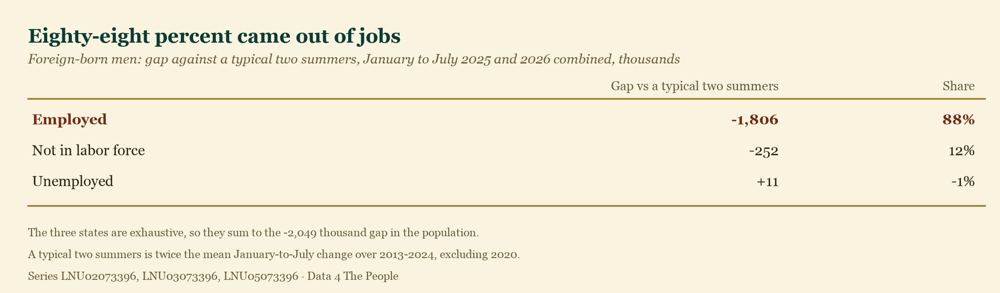
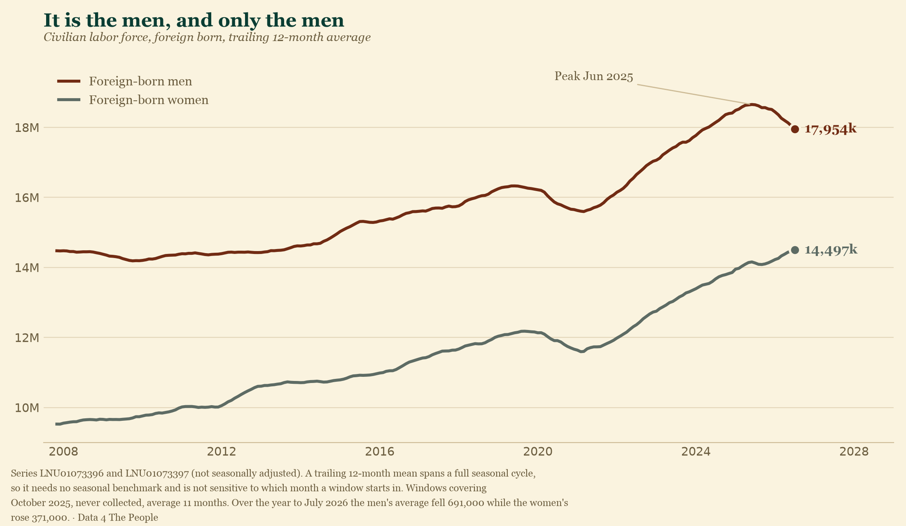

# The men who vanished

After an extended battle with the administration, on July 27, 2026, Temporary Protected Status was revoked for Haitians – stripping work authorization from hundreds of thousands of people and leaving them to choose between going back to a country our own State Department calls dangerous, or staying here without status.

A disclaimer. This is not just a headline for Daytonians like me. Springfield is half an hour up the road, and in many ways feels like part of Dayton. We go there for doctor appointments, to meet people at coffee shops, for festivals.

So maybe I am not the best person to write about what is happening in Springfield now that the Haitian community has lost TPS. Yes, I have a view. But that view is what sent me to the data, and the data is all I plan to put in front of you here – because it calls into question an idea that has become an article of faith lately: that immigrants are taking jobs that would otherwise go to Americans.

## Labor market displacement

Economists have a name for the idea I want to test: labor market displacement. The claim is simple enough. Immigrants take jobs that would otherwise go to non-immigrants, so every one of those jobs is a job an American didn't get. You hear it at the counter and you hear it on the Senate floor.

I am picking that claim on purpose, because it is the one that can actually be settled. It makes a prediction about who is working, and the government counts who is working every single month.

Now, the point of this post is not to call out the irony that a country which worships at the altar of capitalism doesn't much like capitalism when it stops working in their favor (if someone else will work harder for less, well – that's capitalism at work).

Whoops. Couldn't resist.

Rather, this post's purpose is to test this economic theory against the data, and see which side the data agrees with. Does it agree with Springfield's McGregor Metal CEO Jamie McGregor, who called the notion of migrants taking American jobs "hogwash," and said it was "spoken like a true person that has never made a payroll or tried to run a business." Or does it agree with Senator Bernie Moreno who said, "we are going to see a big, huge, booming bonanza here. And we'll make sure those jobs go to American citizens."

To be clear, we don't know how this will play out in Springfield. We are using Springfield as a case study – a way to put a face on national data that has, lately, developed a very strong opinion on this debate.

Enough talk. Let's dive into the government's own numbers.

## The U.S. has lost 2mm+ foreign-born men from the workforce

Let's start with the raw fact, because everything else follows from it.

Since January 2025, the foreign-born male population of the United States has fallen by **2.1 million people**.

A word on how we measure that, because it matters and it's exactly the kind of thing that gets glossed over. Every January, BLS updates its population estimates and does not revise the months behind them. A level in December and a level the following January are not the same ruler. This past January the revision moved roughly 1.5 million people between men and women in a single month. That is how much room is in these figures.

So we don't measure across January. We measure January to July of 2025 — down 1.2 million — and January to July of 2026 — down another 0.9 million. Two clean windows, each on one ruler, added.

Here is how those two summers look against every other summer on record.

They are the two steepest declines in the history of the series. Third place is 2020 — the COVID shutdown — at 336,000. **These past two years dwarf the COVID impact.** In an ordinary year this number barely moves; the typical January-to-July change is about 20,000.

If you like your surprises quantified: measured against the seventeen years before them, these are **5.7 and 4.6 standard deviations** below the mean. I'm not going to translate that into a "one in a million years" statistic, because you cannot characterize a tail like that from seventeen observations, and anyone who tries is selling you something. What it means is simpler, and harder to wave off. **Nothing in the recorded history of this series looks like this.**

## Most have come straight from the employed population

This is the strange part. Given the narrative swirling around the country, you would expect that if 2 million foreign-born men disappeared, they would come out of the unemployed, or out of the ranks of people not in the labor force. Both of those did happen – but no more than a normal summer would produce. The vast majority of the men who are now gone came straight out of employment.

Over the past two years (Jan–July) we have lost **1.4 million workers** from this demographic alone. The whole American labor force grew over that period — but it grew **3.7 million less** than a normal two summers would deliver, and foreign-born men are **1.8 million of that shortfall. Forty-nine percent of it, from a group that is one worker in ten.**

## Native-born men are not taking these jobs

So let's test the other half of the story, the part that says these were jobs that should have gone to "more deserving" native-born Americans.

That claim is testable, and the last two years handed it the cleanest test it will ever get. Roughly a million jobs were vacated. If they had been taken from native-born men, they are now sitting there — unheld, waiting to be taken back.

Were they?

**No.**

Native-born men's employment-population ratio has fallen in each of the last three Julys: 64.2% in 2023, then 63.9%, then 63.4%, and now **62.8%**. For them to have absorbed the 971,000 jobs foreign-born men vacated, it would need to be **63.6%**. It is eight-tenths of a point below that, and moving the wrong way.

I'm using a rate rather than a headcount deliberately. That January revision cut the published native-born male labor force by 1,522,000 in one month, so their raw levels can't be read across it. A ratio divides most of that out. And the ratio says the same thing however you come at it:

- On a **twelve-month average**, which is immune to both seasonality and most of the revision, native-born men have gone 63.6% → 63.3% → 62.9% → 62.3% across four readings.
- **Employment is not keeping up with population.** Between July 2024 and July 2026 the native-born male population grew **2,556,000**. Their employment grew **382,000**.
- **Participation is rising more slowly than it ever has**, outside the pandemic. From January to July 2026 it rose 0.9 points against a typical 1.5 — and the two smallest such rises in twenty years of data are 2025 and 2026.

More native-born men of working age than ever, and a smaller share of them working. That is the precise opposite of accepting jobs vacated by foreign-born men.

## Pesky complexity

I'm not sure when it happened, but simple, emotionally driven cause-and-effect arguments are all the rage now. And people buy them, hook, line and sinker – even when they come from obviously conflicted interests ("There are several reasons to be optimistic that there will be an abundance of jobs in the future." – Mark Zuckerberg).

So here is some bad news. Societies, economies, environments – the entire world – are not as simple as people want you to believe. Distrust anyone who hands you a tidy cause and effect, especially if they are using it to win your vote or your money.

Treat that as basic mental hygiene. Like brushing your teeth so they don't rot.

### The town before the wave

Springfield had been shrinking for sixty years before any of this. The city peaked around **83,000 residents in 1960** and was **58,662** by 2020.

It is also old, and getting older. Clark County now carries **36.5 native-born residents over 65 for every 100 of working age, against 29.5 nationally**. And the working-age half of that is still draining: the city's native-born population aged 25 to 54 **fell 9.2%** over the last decade, more than twice as fast as its native-born population overall.

The plants, meanwhile, had already been gutted. Manufacturing employment in the metro went from **12,900 in 2000 to 6,700 by 2013** – nearly half of it gone before a single Haitian arrived, most of it announced by Navistar in November of 2000.

That was the town when the wave hit. Haitians began arriving in numbers in 2021, after the assassination of President Moïse, and kept coming through 2023 – into a place that was shrinking, aging, short of working-age people, with jobs on the factory floor nobody was there to take.

They took them. The low-paid, physically hard, undesirable ones.

I am not going to tell you they rescued Springfield manufacturing. Employment there had bottomed out a decade earlier, and the 2021–2023 recovery happened in factory towns that saw no immigration at all. What I will tell you is that it has fallen every year since, to **6,000 in 2026 – the lowest in the whole series**.

Now consider who is more likely to be the shift supervisor. The plant manager. Immigrants are not taking those jobs; native-born workers are. So did Haitian workers displace native-born workers in Springfield? Sure – some, here and there (and again, blame capitalism, not the immigrants). But they also saved jobs. The better paid ones, held by the managers who would have been out of work if their employer had shut the doors.

### This isn't just my hypothesis

It has a name – **task specialization** – and the economists Giovanni Peri and Chad Sparber laid it out in a paper of that title.

Workers with similar education aren't interchangeable, because they're good at different things. Immigrants have an edge in manual, physical work. Native-born workers have an edge in anything running on language and knowing how the place works – coordinating, supervising, dealing with the customer. So when immigrants take the manual jobs, natives don't get pushed out of the building. They move up the ladder inside it.

Peri and Sparber's own examples could have been written about Clark County: immigrants become construction workers, cleaning crews and food industry workers, while less-educated natives become **construction site supervisors, farm managers and restaurant managers**.

This is contested. George Borjas has spent a career arguing the other side: that immigration does depress wages and employment for the natives competing most directly. A live argument, not settled science.

But it makes a prediction, and this debate is not for scholars anymore – the U.S. is running the experiment in real time. If immigrants and natives complement each other rather than compete, removing the immigrants shouldn't free up jobs for natives — **it should cost natives jobs too.**

That is what the last two years show: native-born male employment growing 382,000 while their population grew 2,556,000.

## Where the work actually is

All of this rests on something more basic, and it is worth checking on its own: are immigrants and native-born workers actually doing different work? If they were interchangeable — if one could simply slide into the other's job — none of the rest of it follows.

They are not interchangeable. Foreign-born men are **20.5% of all employed men** — about one in five. Sort occupations by how much of the work they are actually doing, and a ladder appears.

Two in five men in farming, fishing and forestry. **One in three of the men on American construction sites — 2.8 million of them.** Nearly a third cleaning and maintaining buildings and grounds; a quarter in healthcare support, and a quarter in restaurant kitchens.

Then it slides. Production, a fifth. Management and professional work, **18%**. Protective service — police, fire, security — **10%**.

The harder, dirtier and worse-paid the work, the more likely the man doing it was born somewhere else. The more the job is about running the place, the less likely.

## Playing with fire?

We have seen enough to hold a strong conviction that America is playing with fire. Nearly a million and a half workers have been erased from payrolls across this country, taking with them the taxes they paid and the money they spent at the grocery store and the movie theater. And unless native-born workers step in and take the jobs they have been saying they wanted – which, so far, they have not – more jobs will follow them out the door, because we are losing a wildly disproportionate share of the people who work in the dirty engine rooms of America.

But I have watched this dynamic with my own eyes, in my own backyard. I am biased. So don't take my word for it. Do the work yourself, if you care about where this country is heading, and then go form your own view on it.

**[Beyond the Unemployment Rate →](https://data4thepeople.github.io/CPS_monthly_explorer/v2/output/ln_explorer.html)**

## What this does not tell you

We are going to be more careful here than the discourse will be.

**The CPS does not measure emigration, and it does not ask about legal status.** It is a household survey. It counts people who live at a sampled address and answer the door. When someone stops being counted, the survey cannot tell you whether they left the country, moved somewhere the sample did not reach, or stopped opening the door to a federal interviewer. All three produce the same missing row. That distinction matters enormously for policy and we cannot settle it with this data.

**Every number here rests on a model, and models have error.** The CPS interviews a sample of about 60,000 households and scales it to the whole country using Census Bureau population estimates — which are themselves built from assumptions about births, deaths and net migration. That is a model. It is wrong by some amount every month, and the January rebases are that error being corrected in public. So do not read 2.1 million as precise to the person. It is not, and we are not claiming otherwise.

**What survives the model error is comparability.** The same instrument, the same questions, the same definitions, month after month for two decades. The level may be off. The *comparison* is what the series is built to support.

**And the strongest evidence here is the comparison, not the level.** Over the identical months, in the identical survey, scaled by the identical model, native-born men came in at **+0.8 and +0.1 standard deviations** — statistically ordinary. Their employment: −0.2 both years. Whatever error the population model carries, both categories carry it at the same time. A shared model error does not produce a 4.6-sigma move in one category and a 0.1-sigma move in the other.

Which is why we would ask you not to let the 2.1 million stand on its own. On its own it is a level estimate from a model, and it deserves exactly the scepticism any such estimate deserves. What gives it force is that it is unprecedented against the series' own twenty-year record, and that the comparison group standing right beside it did not move at all.

**It is also specifically men.** We went looking for the rest of the shortfall in foreign-born women, and did not find it there.

On a trailing twelve-month average, foreign-born men's labor force has fallen **691,000** over the year to July 2026. Foreign-born women's has **risen 371,000**. That matters for what the number can mean: a general story — immigrants leaving, or being counted less well — would pull women down alongside men. Whatever is happening here is happening to men and not to women.

**One more thing, about Springfield specifically.** International Motors filed a notice on July 30, 2026 to lay off 1,341 workers at its Springfield Assembly Plant and Truck Specialty Center, effective October, as it sells the site to Roshel, a Canadian armored-vehicle maker. The coverage attributes it entirely to the sale — no mention of immigration or TPS. Whether the two are connected we cannot tell you; a company's stated reason for selling a plant and its actual reasons are not always the same thing. What we can tell you is that 1,341 jobs are ending in Springfield this autumn, that they are being pinned on a corporate transaction, and that anyone reading the local numbers after October should know it before attributing the fall to anything else.

## Methodology

Every national figure above comes from published BLS Current Population Survey series. Nothing is modeled or estimated by us.

### Why January-to-July windows, and why two of them

BLS introduces new population controls each January and does not revise history, so levels on either side of a January sit on different population bases. The January 2026 revision cut the published native-born male population by about 1,454,000 in one month and the foreign-born male figure by 46,000.

Every window in this post therefore sits inside a single calendar year. The two affected summers are reported separately and added, never measured end to end across the seam. The cost of that choice is honesty about what it excludes: the change between July 2025 and January 2026 is not counted in the 2.1 million, because it cannot be measured cleanly. Measured peak-to-latest across the seam, the decline is 2.2 million.

### What we checked and abandoned

We first tried to split the whole 3.7 million shortfall four ways — foreign-born and native-born, men and women — as a waterfall. The four series do partition the published total exactly, so the arithmetic works. The measurement does not.

Adding two January-to-July windows silently drops the July-to-January months in between, and that dropped stretch behaved very differently by group. For foreign-born men it was −152,000 against a typical +223,000 — close enough to normal that dropping it changes little. For foreign-born **women** it was **+1,143,000** against a typical +191,000, the largest on record in eighteen years. Dropping it manufactured a decline for women that does not exist.

Foreign-born men are the one group the January revision barely touched: −24,000 on the labor force, −46,000 on population. That is why their numbers can be measured across the seam and checked four different ways, and why we make claims about them and not about a four-way split.

### How seasonality is handled

BLS publishes no seasonally adjusted series by nativity, so every series here is unadjusted, and January-to-July is a strongly seasonal window. We hold seasonality constant two ways, neither of which involves adjusting anything:

1. **Against the same window in other years.** "A typical two summers" is twice the mean January-to-July change over 2013–2024, excluding 2020.
2. **Against native-born men.** They experience the same seasons in the same economy. A seasonal or cyclical force would move both groups; it did not.

The 49% share does not depend on which reference period we chose. Recomputed
against six of them — 2013–24, 2015–24, 2011–19, 2014–19, 2013–19, and the three
years immediately before this began — it returns 45, 45, 45, 45, 47 and 48
percent.

### How the decomposition works

Employed, unemployed, and not-in-the-labor-force are exhaustive and mutually exclusive: every person aged 16 and over is in exactly one. So the three changes sum to the population change by construction, and the same holds for the gaps against the benchmark: −1,806 − 252 + 11 = −2,049 thousand. There is no model here, only an identity.

That 88% is a share of the *gap against a normal two summers*. Measured more crudely — the raw change across the whole span from January 2025 to July 2026, every month counted — employment is 61% of the decline, unemployment 19% and the sidelines 20%. Employment is the largest piece on either measure, and on neither one do the not-working boxes carry the story.

### The standard-deviation figures

Each is the January-to-July change for that year, expressed as standard deviations from the mean of the same window in the seventeen reference years — 2007 to 2024, excluding 2020. The two event years are excluded from the reference so that the yardstick is not widened by the thing being measured.

### The occupation table

Occupation detail is published annually by nativity and sex, as each group's percentage distribution across occupations — not as the foreign-born share of each occupation, which is the number the argument needs. We derive it by applying each group's published distribution to its published employment level: foreign-born men in an occupation, divided by all men in it. 2025 annual averages, the latest available. Men only, since that is the group this post is about.

### The Springfield figures

Population, age and nativity for Clark County and Springfield city come from the Census Bureau's American Community Survey, 2020–2024 five-year estimates, tables B06001 (place of birth by age) and B01001. The dependency ratio is people aged 65 and over divided by people aged 18 to 64, times 100, computed identically for the county and the nation. Native-born means born in the state of residence, born in another state, or born abroad to American parents.

One caveat worth stating plainly: **the ACS has not caught up with Springfield.** The five-year file counts 3,535 foreign-born residents in the whole of Clark County, against the 12,000 to 15,000 Haitians described in news coverage, because a five-year average barely registers arrivals concentrated in the last three years. Every foreign-born figure for Clark County should be read as a floor, not a count. Manufacturing employment for the Springfield metro is BLS series SPRI239MFG.

Reproduce any of it yourself:
[github.com/Data4ThePeople/CPS_monthly_explorer](https://github.com/Data4ThePeople/CPS_monthly_explorer)
— `analysis/foreign-born-men/make_charts.py` prints every national number asserted above and regenerates all six images from the source data.
